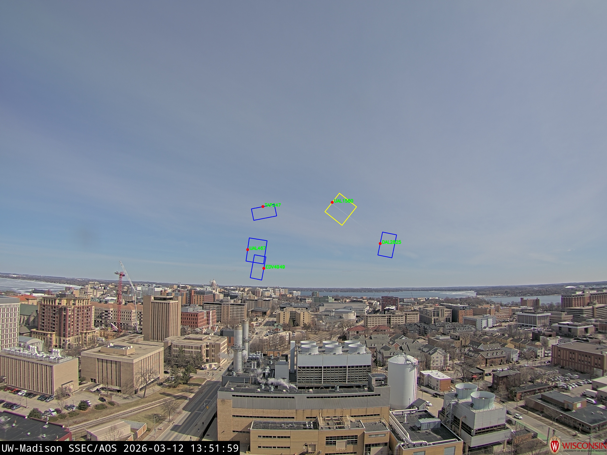

# Groundcam Contrail Observatory

Ground-based camera system for detecting aircraft contrails in real time. The system correlates live ADS-B aircraft tracking data with camera images to identify when and where contrails form, using calibrated camera geometry to project GPS positions onto image pixels and computer vision to detect contrail edges.

**Primary site**: UW-Madison AOSS Building, Madison WI (43.0706°N, −89.4069°W)

---

## Demo



*Annotated frame showing a detected contrail. The yellow bounding rectangle follows the aircraft's 10-second heading history; Hough lines aligned within 8° of the motion vector trigger the alert.*

---

## How It Works

```
ADS-B API (api.adsb.lol)
        ↓  poll every 10s, filter >8000 ft / <100 km
GPS positions per aircraft (lat, lon, alt, timestamp)
        ↓  ECEF → ENU → camera frame (OpenCV distortion model)
Pixel coordinates in camera image
        ↓  Canny edges + Hough lines in aircraft motion region
Contrail classification → CSV + DuckDB + Azure Blob frames
```

Detection fires when ≥2 Hough lines of length ≥40 px are aligned within 8° of the aircraft's motion direction inside a directional bounding rectangle drawn along its 10-second heading history.

---

## Repository Layout

```
live/                     # Real-time pipeline (runs continuously)
  main.py                 # Entry point
  camera.py               # Per-camera polling & frame download
  config.py               # Config loader
  config.yaml             # Site/detection/Azure settings
  analytics.py            # Daily/monthly CSV summaries

non_live/
  contrail_pipeline_uwisc.py   # Batch pipeline for historical data

utils/
  adsb_utils.py           # ADS-B polling, filtering, 1-sec upsampling
  projection_utils.py     # GPS → pixel projection
  detection_utils.py      # Canny + Hough contrail detection
  image_data_utils.py     # Filename parsing (UW-Madison / Arizona / MIT)
  db_utils.py             # DuckDB storage & GeoJSON export
  uwisc_downloader.py     # Concurrent HTTP download from SSEC server

calibration_data/
  uwisc/{east,south}/
    camera_params.json    # Intrinsics K, distortion, rotation R, translation T
```

---

## Setup

```bash
python3 -m venv .venv
source .venv/bin/activate
pip install -r requirements.txt
```

> OpenCV requires system libraries on Linux: `apt-get install libgl1 libglib2.0-0`

---

## Running

### Live pipeline

```bash
python -m live.main --config live/config.yaml
```

The live pipeline polls both the east and south cameras every 120 seconds and ADS-B every 10 seconds. Detection results are appended to daily CSVs in `live_output/` and (optionally) uploaded to Azure Blob Storage.

### Batch pipeline (historical data)

Edit the date/time window in `main()`, then:

```bash
python non_live/contrail_pipeline_uwisc.py
```

Expected inputs:
- ADS-B CSV: `/path/to/easy_adsb/data/madison_pings_YYYY_MM_DD.csv`
- Camera images: `/path/to/images_uwisc/{east,south}/YYYY-MM-DD/`

### Downloading images

```bash
# Single or multiple dates
python utils/uwisc_downloader.py --dates 2025-03-13 2025-03-15

# Date range
python utils/uwisc_downloader.py --start 2025-03-01 --end 2025-03-10
```

---

## Configuration (`live/config.yaml`)

| Section | Key | Description |
|---------|-----|-------------|
| `cameras[].side` | `east` / `south` | Camera identifier |
| `cameras[].poll_interval_s` | `120` | Seconds between image fetches |
| `cameras[].params_path` | path | Camera calibration JSON |
| `adsb.radius_km` | `100` | Aircraft search radius |
| `adsb.min_alt_m` | `2438.4` | Minimum altitude (~8000 ft) |
| `adsb.poll_interval_s` | `10` | ADS-B refresh rate |
| `detection.min_line_length` | `40` | Min Hough line length (px) |
| `analytics.output_dir` | `live_output` | CSV output directory |
| `azure.container` | `contrail-frames` | Blob container name |

Azure credentials are read from the `AZURE_STORAGE_CONNECTION_STRING` environment variable (or set inline in config). Slack alerts use `SLACK_WEBHOOK_URL`.

---

## Camera Calibration

Both cameras share the same GPS origin (AOSS building). Calibration was performed by matching sun/moon positions in images to computed astronomical positions.

| Camera | Focal length | Distortion | Resolution |
|--------|-------------|------------|------------|
| East | ~1365 px | K1 = −0.361 (barrel) | 2592×1944 |
| South | ~1237 px | K1 = +0.140 (pincushion) | 2592×1944 |

`camera_params.json` fields: `K` (3×3 intrinsics), `dist_coeffs`, `R` (rotation world→camera), `T` (translation), `origin_gps`.

---

## Detection Parameters

| Parameter | Value |
|-----------|-------|
| Altitude threshold | >8000 ft (2438 m) |
| Distance threshold | <100 km from camera |
| Rectangle width | 70–100 px |
| Rectangle length | 50–500 px (scales with speed) |
| Min Hough line length | 40 px |
| Min aligned lines | 2 |
| Angle tolerance | 8° |

---

## Deployment

Pushes to `main` trigger the GitHub Actions workflow ([.github/workflows/deploy.yml](.github/workflows/deploy.yml)), which builds a Docker image, pushes it to Azure Container Registry (`contrailregistry`), and redeploys the Azure Container Instance (`contrail-live`, 1 vCPU / 2 GB RAM).

To build and run locally with Docker:

```bash
docker build -t contrail-live .
docker run -e AZURE_STORAGE_CONNECTION_STRING="..." \
           -e SLACK_WEBHOOK_URL="..." \
           contrail-live
```

Required GitHub secrets: `AZURE_CREDENTIALS`, `ACR_USERNAME`, `ACR_PASSWORD`, `AZURE_STORAGE_CONNECTION_STRING`, `SLACK_WEBHOOK_URL`.

---

## External Services

| Service | URL | Auth |
|---------|-----|------|
| ADS-B data | `api.adsb.lol` | None |
| Camera images | `metobs.ssec.wisc.edu` | None |
| Azure Blob Storage | Azure | Connection string |
